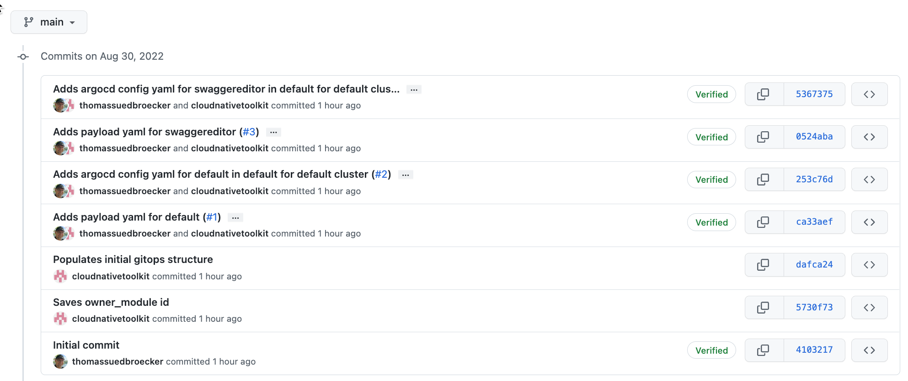
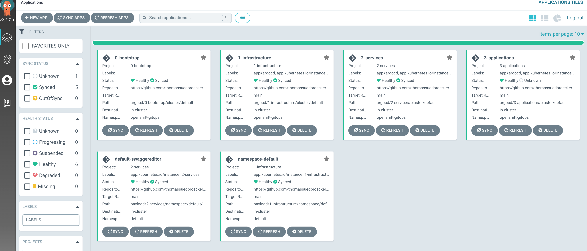
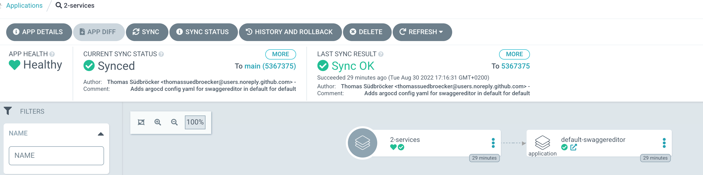
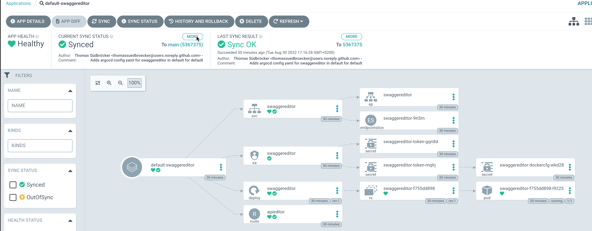

# gitops-verify-swagger-editor-example

# Objective

The objective is to understand how to build new modules for the [`Technology Zone Accelerator Toolkit`](https://modules.cloudnativetoolkit.dev/).

# What does the project do?

In this project we inspect the implementation of following module:

* [terraform-gitops-swagger-editor](https://github.com/cloud-native-toolkit/terraform-gitops-swagger-editor) 

> The current project is related to the inspection of the project [gitops-create-software-everywhere-module](https://github.com/thomassuedbroecker/gitops-create-software-everywhere-module).

# Understanding the module

## 1. [gitops-create-software-everywhere-module](https://github.com/thomassuedbroecker/gitops-create-software-everywhere-module)

### a. Tools used by the module

  * [IBM Cloud Garage CLI](https://github.com/cloud-native-toolkit/ibm-garage-cloud-cli)
    * That tool support CI/CD in a Kubernetes environment using Tekton and Argo CD projects configured with helm. ([Example blog post](https://suedbroecker.net/2021/03/24/start-with-cicd-using-the-cloud-native-toolkit/)) 

The relevant command from `IBM Cloud Garage CLI` for us is the `gitops-module`:
    
```sh
igc gitops-module [name] [contentDir]

Populates the gitops repo with the provided module contents and configures the
ArgoCD application

Positionals:
  name  The name of the module that will be added to GitOps             [string]

Options:
      --version                Show version number                     [boolean]
      --help                   Show help                               [boolean]
  -c, --contentDir             The directory where the payload content has been
                               placed. If not provided defaults to current
                               working directory.                       [string]
  -n, --namespace              Namespace where the secret should be created
                                                             [string] [required]
  -l, --layer                  The gitops layer where the configuration will be
                               deployed (infrastructure, services, applications)
                         [choices: "infrastructure", "services", "applications"]
      --gitopsConfigFile       Name of yaml or json file that contains the
                               gitops config values                     [string]
      --bootstrapRepoUrl       Url of the bootstrap repo that contains the
                               gitops config yaml                       [string]
      --gitopsCredentialsFile  Name of yaml or json file that contains the
                               gitops credentials                       [string]
      --token                  Git personal access token to access gitops repo
                                                                        [string]
      --applicationPath        The path within the payload directory structure
                               where the payload config should be placed. If not
                               provided will default to `name`          [string]
      --branch                 The branch where the payload has been deployed
      --type                   The type of component added to the GitOps repo.
                   [choices: "base", "operators", "instances"] [default: "base"]
      --serverName             The name of the cluster. If not provided will use
                               `default`
      --valueFiles             Comma-separated list of value files that should
                               be applied to the Argo CD application if using a
                               helm chart
      --lock                   Git repo locking style
       [choices: "optimistic", "pessimistic", "branch", "o", "p", "b"] [default:
                                                                       "branch"]
      --autoMerge              Flag indicating that the branch/PR should be
                               automatically merged. Only applies if lock
                               strategy is branch      [boolean] [default: true]
      --rateLimit              Flag indicating that the calls to the git api
                               should be rate limited.[boolean] [default: false]
      --tmpDir                 The temp directory where the gitops repo should
                               be checked out
                                        [string] [default: "/tmp/gitops-module"]
      --debug                  Turn on debug logging                   [boolean]
```

### b. Verify the input for the swagger-editor module?

  * OpenShift
  * VPC
  * Argo CD configuation

### c. Can the swagger-editor module be instantiated reusing the existing environment/infrasture already created?

  * If yes, what are the needed entries in a BOM?
  * If no, what are the needed entries in a BOM?

### d. How is the implementation of the swagger-editor module organized?

  * Which input does it has?
    * Parameters?
  * What does it create?
  * Which automation (bash scripts) does it use and what is realized in that automations?
  * Do we need to know some on special terraform functionaly used?

### f. Setup the module on an OpenShift cluster

#### Step 1: Configure a `BOM` for the entire infrastructure and application

We will reuse the BOM structure from [lab 3 operate](https://operate.cloudnativetoolkit.dev/getting-started/lab3/) and just add following lines and changing the some variable names to create different instances.

```yaml
# Install Swagger editor
    - name: gitops-swagger-editor
      alias: gitops-swagger-editor
      version: v0.0.1
```

An example for the new `BOM`:

```yaml
apiVersion: cloudnativetoolkit.dev/v1alpha1
kind: BillOfMaterial
metadata:
  name: ibm-vpc-roks-argocd-swagger
spec:
  modules:
    # Virtual Private Cloud - related
    # - subnets
    # - gateways
    - name: ibm-vpc
      alias: ibm-vpc
      version: v1.16.0
      variables:
      - name: name
        value: "tsued-gitops-swagger"
      - name: tags
        value: ["tsuedro"]
    - name: ibm-vpc-subnets
      alias: ibm-vpc-subnets
      version: v1.13.2
      variables:
        - name: _count
          value: 1
        - name: name
          value: "tsued-gitops-swagger"
        - name: tags
          value: ["tsuedro"]
    - name: ibm-vpc-gateways
    # ROKS - related
    # - objectstorage
    - name: ibm-ocp-vpc
      alias: ibm-ocp-vpc
      version: v1.15.5
      variables:
        - name: name
          value: "tsued-gitops-swagger"
        - name: worker_count
          value: 2
        - name: tags
          value: ["tsuedro"]
    - name: ibm-object-storage
      alias: ibm-object-storage
      version: v4.0.3
      variables:
        - name: name
          value: "cos_tsued_swagger"
        - name: tags
          value: ["tsuedro"]
        - name: label
          value: ["cos_tsued"]
    # Install OpenShift GitOps and Bootstrap GitOps (aka. ArgoCD) - related
    # - argocd
    # - gitops
    - name: argocd-bootstrap
      alias: argocd-bootstrap
      version: v1.12.0
      variables:
        - name: repo_token
    - name: gitops-repo
      alias: gitops-repo
      version: v1.20.2
      variables:
        - name: host
          value: "github.com"
        - name: type
          value: "GIT"
        - name: org
          value: "thomassuedbroecker"
        - name: username
          value: "thomassuedbroecker"
        - name: project
          value: "iascable-gitops-swagger"
        - name: repo
          value: "iascable-gitops-swagger"
    # Install Swagger editor
    - name: gitops-swagger-editor
      alias: gitops-swagger-editor
      version: v0.0.1
```

#### Step 2: Follow the steps written in [lab 3 operate](https://operate.cloudnativetoolkit.dev/getting-started/lab3/) just with the change `BOM` to setup the environment

The helper automation scripts are already configured and available in the current repository.

Interactive output:

The `swagger editor` will be deployed to the default namespace.

```sh
Provide a value for 'namespace_name':
  The value that should be used for the namespace
> default
```

```sh
Provide a value for 'gitops-repo_host':
  The host for the git repository. The git host used can be a GitHub, GitHub Enterprise, Gitlab, Bitbucket, Gitea or Azure DevOps server. If the host is null assumes in-cluster Gitea instance will be used.
> (github.com) 
Provide a value for 'gitops-repo_org':
  The org/group where the git repository exists/will be provisioned. If the value is left blank then the username org will be used.
> (thomassuedbroecker) 
Provide a value for 'gitops-repo_project':
  The project that will be used for the git repo. (Primarily used for Azure DevOps repos)
> (iascable-gitops-swagger) 
Provide a value for 'gitops-repo_username':
  The username of the user with access to the repository
> (thomassuedbroecker) 
Provide a value for 'gitops-repo_token':
> XXX
> Provide a value for 'ibmcloud_api_key':
> XXX
Provide a value for 'region':
> eu-de
Provide a value for 'worker_count':
  The number of worker nodes that should be provisioned for classic infrastructure
> (2) 
Provide a value for 'ibm-ocp-vpc_flavor':
  The machine type that will be provisioned for classic infrastructure
> (bx2.4x16) 
Provide a value for 'ibm-vpc-subnets__count':
  The number of subnets that should be provisioned
> (1) 
Provide a value for 'namespace_name':
  The value that should be used for the namespace
> default
Provide a value for 'resource_group_name':
  The name of the resource group
> default
```

### Step 3: Verify created resources

```sh
module.argocd-bootstrap.module.openshift_cicd.module.pipelines.data.external.tekton_ready: Reading...
module.argocd-bootstrap.module.openshift_cicd.module.pipelines.data.external.tekton_ready: Read complete after 1s [id=-]
╷
│ Warning: Argument is deprecated
│ 
│   with module.argocd-bootstrap.module.bootstrap.random_string.suffix,
│   on .terraform/modules/argocd-bootstrap.bootstrap/main.tf line 12, in resource "random_string" "suffix":
│   12:   number  = true
│ 
│ Use numeric instead.
│ 
│ (and 6 more similar warnings elsewhere)
╵

Apply complete! Resources: 103 added, 0 changed, 0 destroyed.
```

* GitHub project

It creates a new github project and did following commits:



* Argo CD application configuration

```yaml
apiVersion: argoproj.io/v1alpha1
kind: Application
metadata:
  name: default-swaggereditor
  finalizers:
    - resources-finalizer.argocd.argoproj.io
spec:
  destination:
    namespace: default
    server: https://kubernetes.default.svc
  project: 2-services
  source:
    path: payload/2-services/namespace/default/swaggereditor
    repoURL: https://github.com/thomassuedbroecker/iascable-gitops-swagger.git
    targetRevision: main
    helm:
      releaseName: swaggereditor
  syncPolicy:
    automated:
      prune: true
      selfHeal: true
  ignoreDifferences: []
```

* Argo CD overview



* Argo CD `app-of-apps` 2-services



* Argo CD the instance of the `swagger application`

