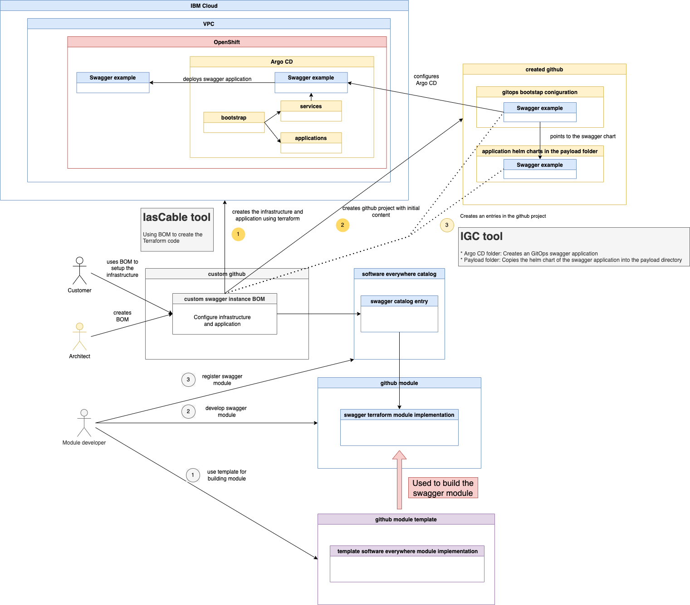

# gitops-verify-swagger-editor-example

# Objective

The objective is to understand how to build new modules for the [`Technology Zone Accelerator Toolkit`](https://modules.cloudnativetoolkit.dev/) based on the implementation of the [terraform-gitops-swagger-editor](https://github.com/cloud-native-toolkit/terraform-gitops-swagger-editor) module.

# What does the project do?

In this project we inspect the implementation of following module:

* [terraform-gitops-swagger-editor](https://github.com/cloud-native-toolkit/terraform-gitops-swagger-editor) 

> The current project is related to the inspection of the project [gitops-create-software-everywhere-module](https://github.com/thomassuedbroecker/gitops-create-software-everywhere-module).

# Understanding the `swagger-editor` module

### a. Tools used by the internal module bash automation

  * [IBM Cloud Garage CLI](https://github.com/cloud-native-toolkit/ibm-garage-cloud-cli)
    * That tool support CI/CD in a Kubernetes environment using Tekton and Argo CD projects configured with helm. ([Example blog post](https://suedbroecker.net/2021/03/24/start-with-cicd-using-the-cloud-native-toolkit/)) 

The relevant command from `IBM Cloud Garage CLI` for us is the `gitops-module`:
    
```sh
igc gitops-module [name] [contentDir]

Populates the gitops repo with the provided module contents and configures the
ArgoCD application
```

### b. Verify the input and output for the swagger-editor module?

* Input

  What do we need as input to deploy the swagger editor application?
  That can be provide by other module or we will provide it.
  The following variable are the input for the `swagger-editor`.

  We find detailed information in the [variables](https://github.com/cloud-native-toolkit/terraform-gitops-swagger-editor/blob/main/variables.tf) file.

  These are the names of the variables for details please visit [variables.tf](https://github.com/cloud-native-toolkit/terraform-gitops-swagger-editor/blob/main/variables.tf) file in the repository.

    * variable "gitops_config" - "Config information regarding the gitops repo structure (app of apps)"
    * variable "git_credentials" - "The credentials for the gitops repo(s)"
    * variable "namespace" - "The namespace where the application should be deployed"
    * variable "kubeseal_cert" - "The certificate/public key used to encrypt the sealed secrets"
    * variable "server_name" - "The name of the server (Cluster masternode URL)"
    * variable "enable_sso" - "Flag indicating if oauth should be applied (only available for OpenShift)"
    * variable "tls_secret_name" - "The name of the secret containing the tls certificate values"
    * variable "cluster_ingress_hostname" - "Ingress hostname of the cluster."
    * variable "cluster_type" - "The cluster type (openshift or kubernetes)"

* Output

  This is the output which can be consumed by other modules.

  These are the names of the outputs for details please visit [output.tf](https://github.com/cloud-native-toolkit/terraform-gitops-swagger-editor/blob/main/outputs.tf) file in the repository.

    * output "name" - "The name of the module"
    * output "branch" - "The branch where the module config has been placed"
    * output "namespace" - "The namespace where the module will be deployed"
    * output "server_name" -  "The server where the module will be deployed"
    * output "layer" - "The layer where the module is deployed"
    * output "type" - description = "The type of module where the module is deployed"

### c. How is the implementation of the swagger-editor module organized?

  You can find details of the implementation of gitops modules [here](https://modules.cloudnativetoolkit.dev/#/how-to/gitops).

  There is also a template github project to implement a "gitops" module you can find [here](https://github.com/cloud-native-toolkit/template-terraform-gitops).

### Simpified overview how to develop and use a custom module

* Module Developer

  Develops a new module to provide an automated setup for an application or infrastructure component.

  His Tasks:

  a. Starting point:

    * Start with a github project based on the module template

  b. Here we need to create:

    * Module implementation
    * Register the module to a catalog

* Architect

  Uses existing `modules` provided by maybe various `catalogs` to define in a `BOM` file his application and infrastructure outline he want to setup automated. He knows exactly the target architecture he want to create by an terraform automation.
  
  His Tasks:

  * He defines a `BOM`
  * He uses `iascabel` to create the `terraform` automation

* Customer

  Only uses` existing predefined BOMs` to create a predefined environment architecture which applies to his needs.

* This a example simplified architecture diagram which show the dependencies

  

### f. Steps to setup the `swagger-editor` module on an OpenShift cluster

#### Step 1: Configure a `BOM` for the entire infrastructure and application

We will reuse the BOM structure from [lab 3 operate](https://operate.cloudnativetoolkit.dev/getting-started/lab3/) and just add following lines and changing the some variable names to create different instances.

```yaml
# Install Swagger editor
    - name: gitops-swagger-editor
      alias: gitops-swagger-editor
      version: v0.0.1
```

An example for the new `BOM`:

```yaml
apiVersion: cloudnativetoolkit.dev/v1alpha1
kind: BillOfMaterial
metadata:
  name: ibm-vpc-roks-argocd-swagger
spec:
  modules:
    # Virtual Private Cloud - related
    # - subnets
    # - gateways
    - name: ibm-vpc
      alias: ibm-vpc
      version: v1.16.0
      variables:
      - name: name
        value: "tsued-gitops-swagger"
      - name: tags
        value: ["tsuedro"]
    - name: ibm-vpc-subnets
      alias: ibm-vpc-subnets
      version: v1.13.2
      variables:
        - name: _count
          value: 1
        - name: name
          value: "tsued-gitops-swagger"
        - name: tags
          value: ["tsuedro"]
    - name: ibm-vpc-gateways
    # ROKS - related
    # - objectstorage
    - name: ibm-ocp-vpc
      alias: ibm-ocp-vpc
      version: v1.15.5
      variables:
        - name: name
          value: "tsued-gitops-swagger"
        - name: worker_count
          value: 2
        - name: tags
          value: ["tsuedro"]
    - name: ibm-object-storage
      alias: ibm-object-storage
      version: v4.0.3
      variables:
        - name: name
          value: "cos_tsued_swagger"
        - name: tags
          value: ["tsuedro"]
        - name: label
          value: ["cos_tsued"]
    # Install OpenShift GitOps and Bootstrap GitOps (aka. ArgoCD) - related
    # - argocd
    # - gitops
    - name: argocd-bootstrap
      alias: argocd-bootstrap
      version: v1.12.0
      variables:
        - name: repo_token
    - name: gitops-repo
      alias: gitops-repo
      version: v1.20.2
      variables:
        - name: host
          value: "github.com"
        - name: type
          value: "GIT"
        - name: org
          value: "thomassuedbroecker"
        - name: username
          value: "thomassuedbroecker"
        - name: project
          value: "iascable-gitops-swagger"
        - name: repo
          value: "iascable-gitops-swagger"
    # Install Swagger editor
    - name: gitops-swagger-editor
      alias: gitops-swagger-editor
      version: v0.0.1
```

#### Step 2: Follow the steps written in [lab 3 operate](https://operate.cloudnativetoolkit.dev/getting-started/lab3/) just with the change `BOM` to setup the environment

The helper automation scripts are already configured and available in the current repository.

Interactive output:

The `swagger editor` will be deployed to the default namespace.

```sh
Provide a value for 'namespace_name':
  The value that should be used for the namespace
> default
```

```sh
Provide a value for 'gitops-repo_host':
  The host for the git repository. The git host used can be a GitHub, GitHub Enterprise, Gitlab, Bitbucket, Gitea or Azure DevOps server. If the host is null assumes in-cluster Gitea instance will be used.
> (github.com) 
Provide a value for 'gitops-repo_org':
  The org/group where the git repository exists/will be provisioned. If the value is left blank then the username org will be used.
> (thomassuedbroecker) 
Provide a value for 'gitops-repo_project':
  The project that will be used for the git repo. (Primarily used for Azure DevOps repos)
> (iascable-gitops-swagger) 
Provide a value for 'gitops-repo_username':
  The username of the user with access to the repository
> (thomassuedbroecker) 
Provide a value for 'gitops-repo_token':
> XXX
> Provide a value for 'ibmcloud_api_key':
> XXX
Provide a value for 'region':
> eu-de
Provide a value for 'worker_count':
  The number of worker nodes that should be provisioned for classic infrastructure
> (2) 
Provide a value for 'ibm-ocp-vpc_flavor':
  The machine type that will be provisioned for classic infrastructure
> (bx2.4x16) 
Provide a value for 'ibm-vpc-subnets__count':
  The number of subnets that should be provisioned
> (1) 
Provide a value for 'namespace_name':
  The value that should be used for the namespace
> default
Provide a value for 'resource_group_name':
  The name of the resource group
> default
```

### Step 3: Verify created resources

```sh
module.argocd-bootstrap.module.openshift_cicd.module.pipelines.data.external.tekton_ready: Reading...
module.argocd-bootstrap.module.openshift_cicd.module.pipelines.data.external.tekton_ready: Read complete after 1s [id=-]
╷
│ Warning: Argument is deprecated
│ 
│   with module.argocd-bootstrap.module.bootstrap.random_string.suffix,
│   on .terraform/modules/argocd-bootstrap.bootstrap/main.tf line 12, in resource "random_string" "suffix":
│   12:   number  = true
│ 
│ Use numeric instead.
│ 
│ (and 6 more similar warnings elsewhere)
╵

Apply complete! Resources: 103 added, 0 changed, 0 destroyed.
```

* GitHub project

It creates a new github project and did following commits:


* Argo CD application configuration

```yaml
apiVersion: argoproj.io/v1alpha1
kind: Application
metadata:
  name: default-swaggereditor
  finalizers:
    - resources-finalizer.argocd.argoproj.io
spec:
  destination:
    namespace: default
    server: https://kubernetes.default.svc
  project: 2-services
  source:
    path: payload/2-services/namespace/default/swaggereditor
    repoURL: https://github.com/thomassuedbroecker/iascable-gitops-swagger.git
    targetRevision: main
    helm:
      releaseName: swaggereditor
  syncPolicy:
    automated:
      prune: true
      selfHeal: true
  ignoreDifferences: []
```

* Argo CD overview


* Argo CD `app-of-apps` 2-services


* Argo CD the instance of the `swagger application`

